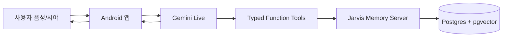
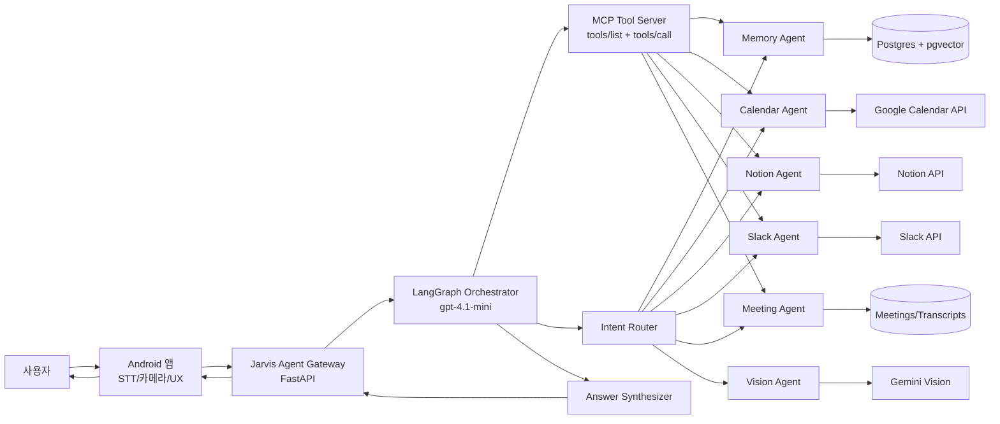
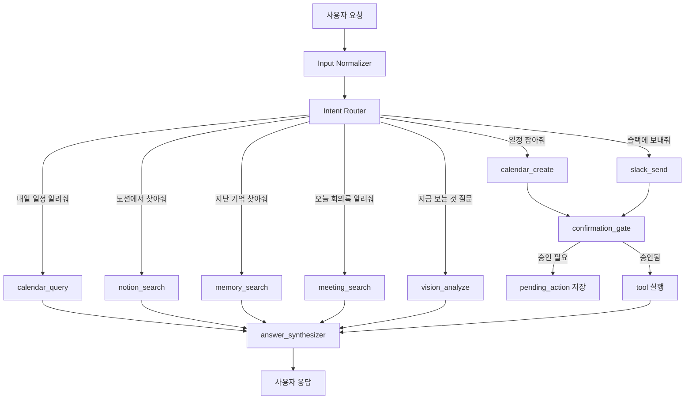

# Jarvis OS LangGraph Agent Architecture

## 1. 목표

Jarvis OS를 현재의 “Android 앱 + Gemini Live + Jarvis Memory Server” 구조에서 “개인 업무 에이전트 플랫폼” 구조로 확장한다.

사용자 예시:

```text
자비스, 내일 일정 알려줘.
자비스, 오늘 회의록 슬랙에 공유해줘.
자비스, 노션에서 지난번 제안서 찾아줘.
자비스, 내일 오후 4시에 워트 미팅 캘린더에 넣어줘.
```

핵심은 사용자의 음성 요청을 AI가 의도 분류하고, 필요한 외부 서비스 도구를 호출한 뒤, 결과를 다시 자연어로 요약하는 구조다.

이번 테스트 구현에서는 백엔드에 표준 MCP 서버를 구축하고, LangGraph가 MCP client 역할로 도구를 발견하고 호출하는 구조를 우선 적용한다.

## 2. 설계 방향

### 현재 구조



### 업그레이드 구조



Android 앱은 모든 분기 로직을 들고 있지 않는다. 앱은 “음성 입력, 이미지 캡처, 사용자 확인 UI, 결과 표시”를 담당하고, LangGraph가 백엔드에서 업무 흐름을 오케스트레이션한다.

## 2.1 모델 결정

테스트 구현의 기본 모델은 `gpt-4.1-mini`로 통일한다.

```text
Router AI: gpt-4.1-mini
Tool Planner AI: gpt-4.1-mini
Answer Synthesizer AI: gpt-4.1-mini
Gemini Live: STT/TTS 중심으로 유지
```

환경변수:

```env
OPENAI_API_KEY=...
JARVIS_ROUTER_MODEL=gpt-4.1-mini
JARVIS_PLANNER_MODEL=gpt-4.1-mini
JARVIS_ANSWER_MODEL=gpt-4.1-mini
```

모델명은 코드에 하드코딩하지 않는다. 추후 비용/성능 테스트 결과에 따라 환경변수만 바꿔 교체한다.

## 3. 왜 LangGraph인가

LangGraph는 LLM 기반 워크플로를 그래프 구조로 구성하고, 상태를 유지하며, 조건부 라우팅과 도구 호출 흐름을 명시적으로 관리하기 좋다. Jarvis처럼 “질문인지, 저장인지, 일정인지, 노션 검색인지, 슬랙 전송인지”를 매번 판단해야 하는 서비스에 적합하다.

## 3.1 왜 표준 MCP 서버인가

MCP는 AI 애플리케이션이 외부 시스템의 도구와 데이터에 표준 방식으로 연결하기 위한 프로토콜이다. 공식 스펙 기준으로 MCP tool은 `tools/list`로 발견되고 `tools/call`로 호출된다. 각 tool은 이름, 설명, `inputSchema`, 선택적 `outputSchema`를 가진다.

Jarvis에서는 MCP를 다음처럼 쓴다.

```text
LangGraph = MCP client
Jarvis Backend = MCP server
Slack/Notion/Google Calendar/Jarvis DB = MCP tools
```

이렇게 하면 Gemini, GPT, Claude 등 모델이 바뀌어도 도구 계층은 표준 형태로 유지된다. 또한 나중에 외부 MCP client가 Jarvis 도구를 직접 쓰는 구조로 확장할 수 있다.

단, MCP tool이 모델 제어 방식으로 호출될 수 있어도 민감한 작업은 코드 레벨에서 반드시 확인한다.

```text
읽기 tool: 즉시 실행 가능
쓰기/전송/삭제/전화/문자 tool: pending_action 생성 후 사용자 확인 필요
```

## 4. 핵심 컴포넌트

### 4.1 Android Client

역할:

- Wake word / AI 버튼
- Android ko-KR STT
- 현재 시야 캡처
- 전화/SMS/캘린더 앱 실행 같은 디바이스 로컬 액션
- 사용자 확인 카드 표시
- 기억/회의/검색 결과 UI

원칙:

- 개인 OAuth 토큰이나 외부 서비스 API 호출 로직은 가능하면 백엔드에 둔다.
- 전화/SMS처럼 폰 OS 권한이 필요한 액션만 앱에서 실행한다.
- 캘린더도 초기에는 Android Intent로 열 수 있지만, “내일 일정 알려줘”처럼 조회가 필요하면 백엔드 Google Calendar API 연동이 필요하다.

### 4.2 Jarvis Agent Gateway

FastAPI에 추가할 신규 레이어.

예상 엔드포인트:

```text
POST /agent/query
POST /agent/confirm
GET  /integrations/status
POST /integrations/google/oauth/callback
POST /integrations/slack/oauth/callback
POST /integrations/notion/oauth/callback
```

역할:

- Android 요청 수신
- 사용자 인증/토큰 확인
- LangGraph 실행
- MCP server tool 목록 조회 및 tool call 실행
- 사용자 확인이 필요한 액션은 pending action으로 저장
- 최종 답변 반환

### 4.3 Jarvis MCP Server

FastAPI 내부에 MCP server 레이어를 추가한다.

MCP tool 예시:

```text
calendar_list_events
calendar_create_event
notion_search
notion_get_page
slack_post_message
slack_search_channel
memory_universal_search
meeting_search
```

각 tool은 JSON Schema 입력을 가진다. 출력은 사람이 읽는 텍스트와 구조화 JSON을 함께 반환한다.

예시:

```json
{
  "name": "calendar_list_events",
  "description": "사용자의 Google Calendar에서 지정 기간 일정을 조회합니다.",
  "inputSchema": {
    "type": "object",
    "properties": {
      "time_min": {"type": "string"},
      "time_max": {"type": "string"},
      "query": {"type": "string"}
    },
    "required": ["time_min", "time_max"]
  }
}
```

### 4.4 LangGraph Orchestrator

그래프 상태 예시:

```python
class JarvisState(TypedDict):
    user_id: str
    text: str
    image_id: str | None
    locale: str
    timezone: str
    intent: str | None
    entities: dict
    tool_results: list[dict]
    pending_action: dict | None
    final_answer: str | None
```

노드:

```text
input_normalizer
intent_router
memory_search
calendar_query
calendar_create
notion_search
slack_send
meeting_search
vision_analyze
requires_confirmation
answer_synthesizer
```

## 5. Intent 분기 설계

분기는 앱 로직이 아니라 AI Router가 한다. 단, 위험한 액션은 코드 정책으로 한 번 더 막는다.



## 6. 외부 서비스 도구 설계

### 6.1 Google Calendar

필요 기능:

- 내일 일정 조회
- 특정 날짜 일정 조회
- 새 일정 생성
- 회의 내용에서 일정 후보 추출 후 등록

도구:

```text
calendar_list_events(time_min, time_max, query?)
calendar_create_event(title, start_at, end_at, location?, description?, attendees?)
calendar_update_event(event_id, patch)
calendar_delete_event(event_id)
```

예시 흐름:

```text
사용자: 내일 일정 알려줘.
Router: calendar_query
Tool: calendar_list_events(time_min=내일 00:00+09:00, time_max=모레 00:00+09:00)
Synthesizer: 오전/오후 순서로 요약
```

### 6.2 Notion

필요 기능:

- 페이지 제목 검색
- 조직/워크스페이스에서 Jarvis integration에 공유된 페이지/DB 검색
- 회의록/메모 저장
- 검색 결과 요약

도구:

```text
notion_search(query, filter?)
notion_get_page(page_id)
notion_query_database(database_id, filter, sorts?)
notion_create_page(parent_id, title, markdown)
```

예시 흐름:

```text
사용자: 노션에서 지난번 제안서 찾아줘.
Router: notion_search
Tool: notion_search(query="제안서")
Tool: notion_get_page(page_id=상위 후보)
Synthesizer: 제목, 수정일, 핵심 내용, 링크 요약
```

Notion은 특정 DB 하나로 제한하지 않는다. 사용자가 Jarvis Notion integration에 공유한 조직/워크스페이스 범위 전체를 검색 대상으로 한다. Notion API 특성상 integration에 공유되지 않은 페이지나 DB는 검색되지 않으므로, 보안 경계는 Notion 권한 공유 설정을 따른다.

정리:

```text
초기 검색 범위: Jarvis integration에 공유된 전체 Notion 페이지/DB
특정 DB 제한: 나중에 사용자가 원할 때 옵션으로 추가
쓰기 저장: 노션 저장/수정은 사용자 확인 후 실행
```

### 6.3 Slack

필요 기능:

- 회의록 채널 공유
- 특정 사람/채널로 요약 전송
- 전송 전 확인

도구:

```text
slack_search_channel(query)
slack_post_message(channel_id, text, blocks?)
slack_open_dm(user_query)
```

예시 흐름:

```text
사용자: 오늘 회의록 개발팀 슬랙에 공유해줘.
Router: slack_send + meeting_search
Tool: meeting_search(query="오늘 회의")
Tool: slack_search_channel(query="개발팀")
Confirmation: "개발팀 채널에 아래 내용 보낼까요?"
Tool after approval: slack_post_message(...)
```

## 7. 확인이 필요한 액션

아래는 무조건 사용자 확인 후 실행한다.

```text
calendar_create_event
calendar_update_event
calendar_delete_event
slack_post_message
notion_create_page
notion_update_page
call_contact
text_contact
```

확인 상태 저장 예시:

```json
{
  "id": "pending_123",
  "user_id": "default",
  "type": "slack_post_message",
  "summary": "오늘 회의록을 #dev-team에 공유",
  "payload": {
    "channel_id": "C123",
    "text": "..."
  },
  "expires_at": "2026-06-24T18:30:00+09:00"
}
```

## 8. 데이터/토큰 저장 구조

신규 테이블 제안:

```text
user_integrations
- id
- user_id
- provider: google | slack | notion
- access_token_encrypted
- refresh_token_encrypted
- scopes
- expires_at
- created_at
- updated_at

agent_runs
- id
- user_id
- input_text
- intent
- status
- final_answer
- created_at

agent_tool_calls
- id
- run_id
- tool_name
- input_json
- output_json
- status
- created_at

pending_actions
- id
- user_id
- action_type
- payload_json
- preview_text
- status: pending | approved | cancelled | executed | expired
- expires_at
- created_at
```

토큰은 평문 저장 금지. 서버 환경변수의 암호화 키로 암호화해서 저장한다.

추가 로그 정책:

```text
모든 agent run 저장
모든 MCP tool call 저장
tool input/output 일부 마스킹 저장
OAuth token 값은 절대 로그에 저장하지 않음
Slack/Notion/Calendar 쓰기 작업은 pending_action과 approval 기록 저장
```

## 8.1 OAuth 연결 UX

앱 설정 화면에 연결 버튼을 둔다.

```text
Google Calendar 연결
Slack 연결
Notion 연결
```

사용자 흐름:

```text
앱 설정에서 연결 버튼 클릭
→ Android Custom Tab 또는 브라우저 열기
→ /integrations/{provider}/connect
→ provider OAuth 승인
→ /integrations/{provider}/callback
→ 백엔드 토큰 암호화 저장
→ jarvis://integrations/{provider}/connected 로 앱 복귀
```

연결 상태 조회:

```text
GET /integrations/status
```

테스트 단계에서는 `user_id = default`로 시작한다. 여러 폰 테스트가 필요해지면 `device_id` 또는 간단한 사용자 선택값으로 분리한다.

## 9. 추천 실행 단계

### Phase 1. MCP 서버 골격 + Calendar 조회

가장 먼저 만들 기능:

```text
자비스, 내일 일정 알려줘.
```

이유:

- 읽기 전용이라 위험이 낮다.
- OAuth와 LangGraph 라우팅 검증에 좋다.
- 사용자 가치가 바로 보인다.

구현:

- FastAPI 내부 MCP server 골격
- `tools/list`, `tools/call` 또는 MCP SDK 기반 equivalent 구현
- Google OAuth 연결
- `calendar_list_events` 도구
- `/agent/query` 엔드포인트
- Android에서 기존 Gemini 직접 도구 호출 대신 `/agent/query` 호출 옵션 추가

### Phase 2. Slack 기본 채널 회의록 공유

```text
자비스, 오늘 회의록 슬랙에 공유해줘.
```

구현:

- Slack OAuth
- 테스트용 기본 채널 설정
- 회의록 검색
- 전송 전 확인
- 승인 후 `slack_post_message`

처음에는 채널 검색보다 기본 채널 전송이 우선이다.

```env
SLACK_DEFAULT_CHANNEL_ID=...
```

### Phase 3. Notion 조직 범위 검색

```text
자비스, 노션에서 지난번 회의록 찾아줘.
```

구현:

- Notion OAuth 또는 Internal Integration Token
- Jarvis integration에 공유된 전체 범위 검색
- `notion_search`
- `notion_get_page`
- 검색 결과 요약

### Phase 4. 쓰기 액션 확장

```text
내일 오후 4시에 워트 미팅 일정 잡아줘.
오늘 회의록 노션에 정리해줘.
```

쓰기 액션은 반드시 confirmation gate를 통과한다.

### Phase 5. Calendar 생성

```text
내일 오후 4시에 워트 미팅 일정 잡아줘.
```

구현:

- `calendar_create_event`
- 일정 내용 프리뷰
- 앱 확인 카드
- 승인 후 Google Calendar 생성

## 10. 현재 Jarvis와의 통합 방식

처음부터 Gemini Live를 전부 제거하지 않는다.

권장 전환:

```text
STT/TTS: Gemini Live 유지
현재 시야 질문/이미지 해석: 초기에는 Gemini Vision 유지, 이후 필요하면 서버 vision tool로 이동
기억 저장/검색: Jarvis Memory Server 유지
외부 서비스 업무: LangGraph Agent Gateway + MCP Server 추가
답변 최종 합성: gpt-4.1-mini
```

Android 입장에서는 도구가 두 묶음으로 나뉜다.

```text
로컬 도구:
- capture_current_view
- call_contact
- text_contact
- create_contact

서버 에이전트 도구:
- ask_jarvis_agent(text, image_id?)
```

장기적으로는 Gemini가 직접 20개 도구를 들고 판단하는 구조보다, `ask_jarvis_agent` 하나로 백엔드 LangGraph에 넘기는 구조가 안정적이다.

## 10.1 GET/POST 원칙

사용자는 GET/POST를 신경 쓰지 않는다. 앱은 모든 자연어 요청을 하나의 POST로 보낸다.

```text
POST /agent/query
```

읽기 요청도 `/agent/query`는 POST다. 이유는 음성 텍스트, 이미지 ID, 시간대, 사용자 컨텍스트, 이전 대화 상태가 함께 들어가기 때문이다. 내부에서 Google Calendar나 Notion API가 GET/POST를 쓰는지는 MCP tool executor가 결정한다.

쓰기 요청은 바로 실행하지 않는다.

```text
POST /agent/query
→ pending_action 반환
→ 앱 확인 카드 표시
→ POST /agent/confirm
→ 실제 MCP tool 실행
```

## 11. 최종 사용자 흐름 예시

### 내일 일정 조회

```text
사용자: 자비스, 내일 일정 알려줘.
앱: STT 텍스트 생성
서버: LangGraph 실행
Router: calendar_query
Tool: Google Calendar events.list
AI: 일정 요약
응답: 내일 오전 10시 KBS 미팅, 오후 4시 워트 미팅이 있습니다.
```

### 회의록 Slack 공유

```text
사용자: 자비스, 오늘 회의록 개발팀 슬랙에 공유해줘.
Router: meeting_search + slack_send
Tool: 오늘 회의록 검색
Tool: 개발팀 채널 검색
Confirmation: 개발팀 채널에 이 요약을 보낼까요?
사용자: 보내.
Tool: slack_post_message
응답: 개발팀 채널에 공유했습니다.
```

### Notion 검색

```text
사용자: 자비스, 노션에서 배터리 제안서 찾아줘.
Router: notion_search
Tool: Notion search
Tool: 상위 페이지 내용 조회
응답: 가장 관련 높은 문서는 "DH배터리 제안서 v2"입니다. 마지막 수정일은 ...
```

## 12. 결론

Jarvis OS는 LangGraph를 백엔드 오케스트레이터로 추가하고, 표준 MCP 서버를 Jarvis Backend에 구축하는 방향이 맞다.

핵심 판단:

- 분기 판단은 AI Router가 한다.
- 실제 API 호출은 MCP server tool executor가 한다.
- 결과 해석은 gpt-4.1-mini 기반 AI Synthesizer가 한다.
- 위험한 실행은 코드 레벨 confirmation gate가 막는다.
- Android 앱은 UX와 디바이스 로컬 기능에 집중한다.

가장 먼저 구현할 기능은 `내일 일정 알려줘`다. 이 기능 하나로 OAuth, MCP tool, 외부 API 조회, LangGraph 라우팅, 최종 요약까지 전체 골격을 검증할 수 있다.

## 13. 최종 확정 사항

```text
모델: gpt-4.1-mini
Gemini Live: STT/TTS 중심 유지
도구 연결: 표준 MCP 서버를 Jarvis Backend에 구축
LangGraph: MCP client + workflow orchestrator
OAuth: 앱에서 연결 시작, 백엔드가 토큰 암호화 저장
API 입력: POST /agent/query
실행 확인: POST /agent/confirm
읽기 액션: 즉시 실행 가능
쓰기/전송/삭제/전화/문자: 무조건 확인 카드
Google Calendar: 조회 우선
Slack: 테스트 기본 채널 공유 우선
Notion: Jarvis integration에 공유된 조직/워크스페이스 범위 검색
로그: agent_runs, agent_tool_calls, pending_actions 저장
```

남은 결정 사항:

```text
Google OAuth Client ID/Secret
Slack 앱 생성 및 기본 채널 ID
Notion integration 방식: OAuth 또는 internal integration token
OPENAI_API_KEY 입력
앱 설정 화면에 OAuth 연결 버튼 배치
```
